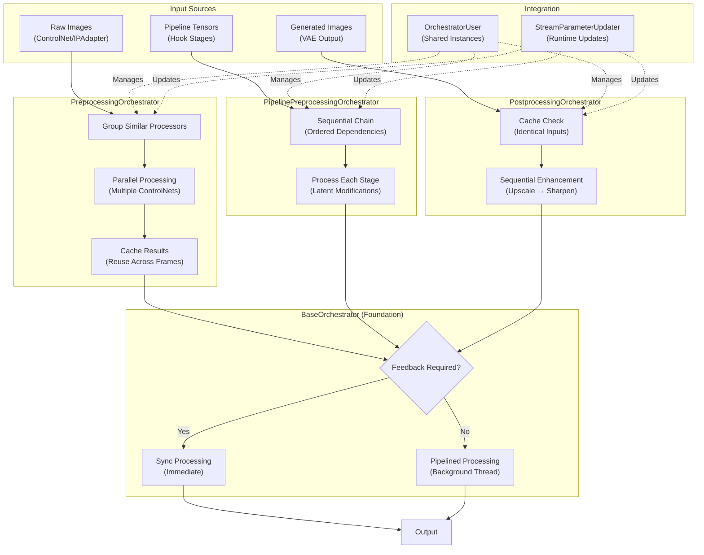

# Orchestrator Flow



## Frame Lifecycle & Parallelism

The orchestrators enable real-time performance through both **intraframe** and **interframe** parallelism:

### Temporal Pipeline
Frame lifecycle: `{[Preprocess N+1] || Diffuse N || [Postprocess N-1]}`
- `{}` = interframe sequencing
- `[]` = intraframe parallelism  
- `||` = concurrent execution across temporal stages

```mermaid
gantt
    title Frame Pipeline: Concurrent Temporal Stages
    dateFormat X
    axisFormat %s
    
    section Frame N-1
    Preprocessing N-1    :done, prep-n1, 0, 1s
    Diffusion N-1       :done, diff-n1, 1, 2s
    Postprocessing N-1  :active, post-n1, 2, 3s
    
    section Frame N
    Preprocessing N     :done, prep-n, 1, 2s
    Diffusion N        :active, diff-n, 2, 3s
    Postprocessing N   :post-n, 3, 4s
    
    section Frame N+1
    Preprocessing N+1  :active, prep-n1-next, 2, 3s
    Diffusion N+1     :diff-n1-next, 3, 4s
    Postprocessing N+1 :post-n1-next, 4, 5s
```



### Parallelism Types

```mermaid
graph TB
    subgraph "Intraframe Parallelism (Within Single Frame)"
        A1["Depth Detection"]
        A2["Canny Detection"]
        A3["Pose Detection"]
        A1 -.->|"Parallel"| A2
        A2 -.->|"Parallel"| A3
        A1 --> B1["Grouped Results"]
        A2 --> B1
        A3 --> B1
    end
    
    subgraph "Interframe Parallelism (Across Time)"
        C1["Frame N-1<br/>Postprocess"]
        C2["Frame N<br/>Diffusion"]
        C3["Frame N+1<br/>Preprocess"]
        C1 -.->|"Concurrent"| C2
        C2 -.->|"Concurrent"| C3
    end
    
    subgraph "Combined Effect"
        D["Pipeline Throughput:<br/>3x Frame Overlap +<br/>Nx Processor Parallelism"]
    end
    
    B1 --> D
    C3 --> D