# SDXL vs SD1.5 Pipeline Comparison

```mermaid
graph TB
    subgraph "Model Detection & Architecture"
        A[Input Model] --> B{Model Detection}
        B -->|SD1.5/SD2.1| C["Single Text Encoder<br/>CLIP ViT-L: 768 dim"]
        B -->|SDXL| D["Dual Text Encoders<br/>CLIP ViT-L: 768 dim<br/>OpenCLIP ViT-bigG: 1280 dim"]
        
        C --> E["UNet Architecture<br/>4 Down Blocks<br/>12 ControlNet outputs"]
        D --> F["UNet Architecture<br/>3 Down Blocks<br/>9 ControlNet outputs"]
    end
    
    subgraph "Text Encoding Phase"
        G[Prompt Input] --> H{Model Type?}
        H -->|SD1.5| I["Single encode_prompt()<br/>Returns: 2 tensors<br/>- prompt_embeds [B, 77, 768]<br/>- negative_prompt_embeds [B, 77, 768]"]
        H -->|SDXL| J["Dual encode_prompt()<br/>Returns: 4 tensors<br/>- prompt_embeds [B, 77, 2048]<br/>- negative_prompt_embeds [B, 77, 2048]<br/>- pooled_prompt_embeds [B, 1280]<br/>- negative_pooled_prompt_embeds [B, 1280]"]
        
        I --> K["Concatenated Embeddings<br/>Context Dim: 768"]
        J --> L["Concatenated Embeddings<br/>Context Dim: 2048<br/>+ Micro-conditioning"]
    end
    
    subgraph "SDXL Micro-Conditioning"
        M[Size/Crop Info] --> N["Time IDs Creation<br/>[original_size, crops, target_size]"]
        N --> O["Added Cond Kwargs<br/>text_embeds: [B, 1280]<br/>time_ids: [B, 6]"]
        O --> P["Conditioning Cache<br/>Per batch/CFG type"]
    end
    
    subgraph "UNet Calling Conventions"
        Q[UNet Forward Call] --> R{Model Type?}
        R -->|SD1.5| S["Positional Arguments<br/>unet(sample, timestep, encoder_hidden_states)<br/>+ return_dict=False"]
        R -->|SDXL| T["Named Arguments<br/>unet(sample, timestep, encoder_hidden_states,<br/>added_cond_kwargs=conditioning)<br/>+ return_dict=False"]
        
        S --> U["Standard UNet Output<br/>[noise_prediction]"]
        T --> V["Standard UNet Output<br/>[noise_prediction]"]
    end
    
    subgraph "ControlNet Integration"
        W[ControlNet Input] --> X{Model Type?}
        X -->|SD1.5| Y["12 Down Block Residuals<br/>+ 1 Mid Block Residual<br/>Standard ControlNet"]
        X -->|SDXL| Z["9 Down Block Residuals<br/>+ 1 Mid Block Residual<br/>SDXL ControlNet + added_cond_kwargs"]
        
        Y --> AA["Residual Injection<br/>down_block_additional_residuals<br/>mid_block_additional_residual"]
        Z --> BB["Residual Injection + Conditioning<br/>down_block_additional_residuals<br/>mid_block_additional_residual<br/>+ added_cond_kwargs"]
    end
    
    subgraph "TensorRT Export Differences"
        CC[ONNX Export] --> DD{Model Type?}
        DD -->|SD1.5| EE["Standard Export<br/>Inputs: sample, timestep, encoder_hidden_states<br/>Outputs: noise_prediction"]
        DD -->|SDXL| FF["SDXL Export<br/>Inputs: sample, timestep, encoder_hidden_states,<br/>text_embeds, time_ids<br/>Outputs: noise_prediction"]
        
        EE --> GG["TensorRT Engine<br/>Standard UNet"]
        FF --> HH["TensorRT Engine<br/>SDXL UNet + Conditioning"]
    end
    
    subgraph "Memory & Performance"
        II[Memory Usage] --> JJ{Model Type?}
        JJ -->|SD1.5| KK["Lower Memory<br/>- Single text encoder<br/>- Smaller embeddings (768 dim)<br/>- Standard UNet"]
        JJ -->|SDXL| LL["Higher Memory<br/>- Dual text encoders<br/>- Larger embeddings (2048 dim)<br/>- Micro-conditioning cache<br/>- Larger UNet"]
        
        MM[Performance] --> NN{Model Type?}
        NN -->|SD1.5| OO["Faster Inference<br/>- Simpler architecture<br/>- Less conditioning overhead"]
        NN -->|SDXL| PP["Slower Inference<br/>- More complex conditioning<br/>- Larger model size<br/>- Additional tensor operations"]
    end
    
    subgraph "Configuration Differences"
        QQ[Config Parameters] --> RR{Model Type?}
        RR -->|SD1.5| SS["Standard Config<br/>- model_id<br/>- t_index_list<br/>- width/height<br/>- cfg_type"]
        RR -->|SDXL| TT["SDXL Config<br/>- model_id (SDXL specific)<br/>- t_index_list<br/>- width/height (1024x1024 typical)<br/>- cfg_type<br/>- Micro-conditioning params"]
    end
    
    %% Connections
    C --> I
    D --> J
    L --> P
    P --> T
    K --> S
    L --> T
    E --> Y
    F --> Z
    AA --> S
    BB --> T
    EE --> GG
    FF --> HH
    
    %% Styling
    classDef sdxl fill:#e1f5fe,stroke:#01579b,stroke-width:2px
    classDef sd15 fill:#f3e5f5,stroke:#4a148c,stroke-width:2px
    classDef common fill:#e8f5e8,stroke:#2e7d32,stroke-width:2px
    
    class D,F,J,L,O,P,T,Z,BB,FF,HH,LL,PP,TT sdxl
    class C,E,I,K,S,Y,AA,EE,GG,KK,OO,SS sd15
    class A,B,G,M,Q,W,CC,II,MM,QQ common
```

## Key Differences Summary

### **Text Encoding**
- **SD1.5**: Single CLIP ViT-L encoder (768 dim), 2 output tensors
- **SDXL**: Dual encoders (CLIP ViT-L + OpenCLIP ViT-bigG), 4 output tensors (2048 dim total)

### **UNet Architecture**
- **SD1.5**: 4 down blocks, 12 ControlNet residual outputs
- **SDXL**: 3 down blocks, 9 ControlNet residual outputs

### **Conditioning**
- **SD1.5**: Basic text conditioning only
- **SDXL**: Text + micro-conditioning (size, crop, target resolution)

### **UNet Calling**
- **SD1.5**: Positional arguments, simple interface
- **SDXL**: Named arguments with `added_cond_kwargs` for micro-conditioning

### **Memory & Performance**
- **SD1.5**: Lower memory, faster inference
- **SDXL**: Higher memory, more complex but better quality

### **TensorRT Integration**
- **SD1.5**: Standard export with 3 inputs
- **SDXL**: Extended export with 5 inputs (including conditioning)

---

*See [Overall Architecture](overall_architecture.md) for complete pipeline flow.*
